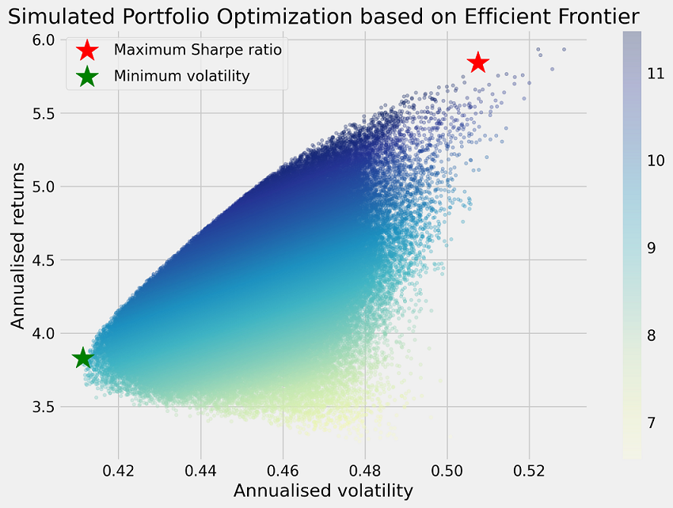

# Numerai Portfolio Optimizer

# Why use a Portfolio Optimizer?
Are you:
- Regularly submitting 20+ live models but don't know how to best allocate your NMR stakes?🤔
- Don't know metric multiplier (0.5x, 1x, 2x) to pick for your models to maximize risk-adjusted return? 
- Suffered from BIG burn in 1-2 over-staked models, while all the other models were doing fine?🔥
- Suffered from prolonged burn in bad market regime, want to control your overall drawdown, minimize your risks?

**Portfolio Optimizer is here to help!**

Portfolio Optimization originates from Harry Markowitz's Model Portfolio Theory (1952). The core idea is to find a balance between the risk-return tradeoff, through constructing an efficient set of portfolios - **Efficient Frontier**. The concept is widely used in the financial industry, and it is also applicable to Numerai model staking. It takes into account the **correlation between models**, and **historical return**, to find the optimal weights of the models to build your portfolio.

Common types of portfolios:
1. **Maximize the risk-adjusted return** (Max Sharpe ratio=> mean return / standard deviation) 
    - Higher Sharpe ratio => better model (return is yummy😋)
2. **Minimize the volatility** (Min standard deviation)
    - Lower standard deviation => better model (burn is painful...)

# How does it work?
- Step 1: Extract model performance metrics (Numerai Corr / True Contribution) using Numerai API (or compute model performance from validation set)
- Step 2: Use the optimizer to find the optimal weights of the models
- Step 3: Review and select your optimal portfolio mix for model staking

# Development Status
- [x] Support portfolio optimization for live models
- [x] Support simulating different allocation of metrics multiplier (Numerai Correlation: 0.5x, 1x | True Contribution: 0x, 0.5x, 1x, 2x, 3x)
- [ ] Support portfolio optimization for on validation set
- [ ] Add flexibility for portfolio constraints (return vs. risk tradeoff)

# Reference 
- [bor's R example of a Numerai portfolio optimizer](https://github.com/BorisVSchmid/vladthestaker)
- [Medium post on Efficient Frontier](https://towardsdatascience.com/efficient-frontier-portfolio-optimisation-in-python-e7844051e7f)
- [Medium post about Model Portfolio Theory](https://medium.com/python-data/effient-frontier-in-python-34b0c3043314)
- [Numerai's official docs on model staking](https://docs.numer.ai/numerai-tournament/staking)

# Disclaimer
- The information and code provided in this GitHub repository are for educational and entertainment purposes only. Any information in this repository is not intended to be used as financial advice, and the owner, contributor of this repository are not financial advisors.
- The owner and contributor of this repository do not guarantee the accuracy or completeness of the information provided, and they are not responsible for any losses or damages that may arise from the use of this information or code. 
